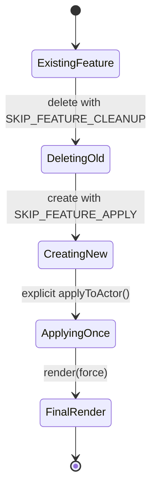

# Feature Lifecycle Guide (Feature, Bioclass, Aspect)

This document explains how feature items behave across create, update, and delete flows in the current system.

## Scope and Current Source of Truth

Primary files:

- `module/data/item-feature.mjs` (shared lifecycle + replacement orchestration)
- `module/data/item-bioclass.mjs` (bioclass-specific sync/cleanup)
- `module/data/item-aspect.mjs` (aspect-specific schema + preset ability updates)
- `module/sheets/actor-sheet.mjs` (drop handlers that call shared replacement orchestration)

## Architecture at a Glance

- `SynthicideFeature` is the shared base for actor “single-slot feature” items.
- `SynthicideBioclass` extends `SynthicideFeature` and adds actor-stat synchronization.
- `SynthicideAspect` extends `SynthicideFeature` and currently only updates aspect abilities/presets.

### Responsibility Split

- **Config layer (`module/helpers/config.mjs`)**
  - stores preset data (`bioclassPresets`, `aspectPresets`)
  - resolves presets (`getFeaturePreset`)
- **Feature data models**
  - enforce schemas
  - generate trait items
  - apply/remove side effects from actors

---

## Lifecycle Flows

## 1) Create Flow

When a feature item is created on an actor:

1. `SynthicideFeature._onCreate(...)` runs.
2. If current user and not skipped via operation option, it calls `applyToActor(...)`.
3. `applyToActor(...)` executes:
   - `_removeFeatureTraits(...)`
   - `_createFeatureTraits(...)`
   - `_syncFeatureAttributes(...)` (delegates to subtype hook)

### Create Sequence Diagram

```mermaid
sequenceDiagram
  participant Sheet as Actor Sheet
  participant Feature as SynthicideFeature
  participant Actor as Actor
  participant Subtype as Bioclass/Aspect subtype

  Sheet->>Actor: createEmbeddedDocuments(Item)
  Actor->>Feature: _onCreate(data, options, userId)
  alt skip apply option set
    Feature-->>Actor: return (no auto-apply)
  else normal create
    Feature->>Feature: applyToActor(actor)
    Feature->>Actor: delete trait items for featureType
    Feature->>Actor: create trait items from system.traits
    Feature->>Subtype: _syncSubtypeAttributes(actor)
  end
```

---

## 2) Update Flow

### Shared update behavior (`SynthicideFeature`)

`_onUpdate(...)` re-applies feature side effects when:

- `system.traits` changed, or
- subtype changed (`featureType`, `bioclassType`, or `aspectType`)

### Shared pre-update behavior (`SynthicideFeature`)

`_preUpdate(...)` seeds default trait arrays when subtype changes **and** traits were not explicitly supplied in the update payload.

This prevents stale subtype traits when changing subtype selectors.

### Subclass update behavior

- `SynthicideBioclass._preUpdate(...)`
  - when `bioclassType` changes, syncs:
    - `system.startingAttributes`
    - `system.bodySlots`
    - `system.brainSlots`
- `SynthicideAspect._preUpdate(...)`
  - when `aspectType` changes, syncs:
    - `system.abilities`

---

## 3) Delete Flow

When a feature is deleted:

1. `SynthicideFeature._preDelete(...)` captures owning actor.
2. `SynthicideFeature._onDelete(...)` runs:
   - remove generated trait items unless cleanup skip option is set
   - call subtype cleanup hook (`_cleanupOnDelete(...)`)
   - re-aggregate actor modifiers

### Bioclass delete cleanup

`SynthicideBioclass._cleanupOnDelete(...)` resets bioclass-sourced actor values:

- attribute bases in `system.attributes.*.base` (for keys in effective starting attrs)
- `system.hitPoints.base`
- `system.hitPoints.perLevel`
- `system.bodySlots` / `system.brainSlots` (if those properties exist)

### Delete Sequence Diagram

```mermaid
sequenceDiagram
  participant Actor as Actor
  participant Feature as SynthicideFeature
  participant Bioclass as SynthicideBioclass

  Actor->>Feature: _preDelete(options, userId)
  Feature->>Feature: capture _deletingActor
  Actor->>Feature: _onDelete(options, userId)
  alt cleanup not skipped
    Feature->>Actor: remove generated feature traits
    Feature->>Bioclass: _cleanupOnDelete(actor)
  else replacement flow
    Feature-->>Actor: skip old cleanup
  end
  Feature->>Actor: aggregateAndApplyItemModifiers(...)
```

---

## Replacement Drop Flow (Bioclass/Aspect)

The actor sheet does not hand-roll replacement logic. It calls:

- `SynthicideFeature.replaceOnActor(actor, 'bioclass' | 'aspect', ...)`

This method ensures deterministic replacement order:

1. delete existing feature of same type with `SKIP_FEATURE_CLEANUP`
2. create incoming feature with `SKIP_FEATURE_APPLY`
3. manually `await feature.applyToActor(...)` once
4. create non-feature dropped items
5. final single render

### Why operation options exist

`SynthicideFeature.OPERATION_OPTIONS`:

- `SKIP_FEATURE_CLEANUP`: avoids old feature delete cleanup racing with new apply
- `SKIP_FEATURE_APPLY`: avoids duplicate apply from `_onCreate`

This gives one authoritative apply pass and avoids stale intermediate UI states.

### Replacement State Diagram



---

## Practical Examples

## Example A: Changing bioclass type on an existing bioclass item

Input update contains `system.bioclassType = 'rigfiend'`.

Effects:

1. `SynthicideBioclass._preUpdate` updates `startingAttributes/bodySlots/brainSlots` from preset.
2. Shared `_preUpdate` seeds default traits for new subtype if `traits` absent in payload.
3. `_onUpdate` sees subtype change and calls `applyToActor`.
4. Actor trait items are recreated for bioclass; actor base stats/hp are synchronized.

## Example B: Replacing aspect via drag-and-drop onto actor sheet

1. Actor sheet calls `replaceOnActor(..., 'aspect', ...)`.
2. Existing aspect delete uses cleanup-skip option.
3. New aspect create uses apply-skip option.
4. Explicit single `applyToActor` creates aspect trait items and executes subtype sync hook (currently no-op for actor stats).
5. Final render occurs once with consistent data.

---

## Expansion Guidance (Especially Aspects)

## Current aspect capability

- Has subtype discriminator (`aspectType`)
- Derives default traits from presets
- Updates `system.abilities` when subtype changes
- Uses shared trait apply/remove lifecycle
- No actor-stat synchronization yet (subtype sync hook remains inherited no-op)

## If aspects need actor-stat side effects later

1. Implement `SynthicideAspect._syncSubtypeAttributes(actor, { render })`.
2. Keep side effects idempotent (safe when apply runs repeatedly).
3. Avoid direct sheet orchestration changes; continue using `replaceOnActor`.
4. Add/extend `_cleanupOnDelete` only for values aspects own.

## Recommended extension checklist

- Add new aspect subtype to `SYNTHICIDE.aspectTypes`.
- Add preset entry in `SYNTHICIDE.aspectPresets` (traits/abilities and future fields).
- Extend aspect schema fields only if needed.
- In `_preUpdate`, sync only fields derived from subtype change.
- Keep shared trait seeding in base `SynthicideFeature._preUpdate` as authority.
- If adding actor side effects, implement subtype hook + matching cleanup.
- Validate replacement flow still performs single apply and single final render.

## Guardrails for future changes

- Keep replacement orchestration centralized in `replaceOnActor`.
- Keep subtype-specific behavior in subclass hooks (`_syncSubtypeAttributes`, `_cleanupOnDelete`, subtype `_preUpdate`).
- Keep preset data lookup in config (`getFeaturePreset`) and behavior in item classes.
- Prefer additive hooks over branching in shared base class.

---

## Quick Reference (Hook Ownership)

- `SynthicideFeature`
  - `_onCreate`, `_onUpdate`, `_preDelete`, `_onDelete`, `applyToActor`, trait create/remove, replacement orchestration
- `SynthicideBioclass`
  - `_preUpdate` (derived schema fields), `_syncSubtypeAttributes`, `_cleanupOnDelete`
- `SynthicideAspect`
  - `_preUpdate` (abilities refresh), schema defaults

This design keeps shared lifecycle flow predictable while allowing bioclass/aspect divergence in small override points.